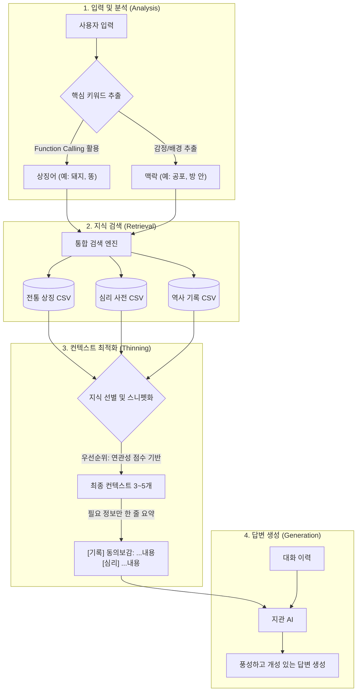

# 꿈 해몽 프로세스 고도화 기획안

이 문서는 꿈 해몽 서비스 '꿈몽'의 AI 답변 품질을 높이고, 데이터를 효율적으로 활용하기 위한 전략을 정리합니다.

## 1. 현황 분석 및 문제점
- **지식 활용의 한계**: 현재 `korean_traditional_symbols.csv` 한 가지만 활용 중.
- **풍부한 데이터의 방치**: 역사적 기록(동의보감, 실록), 글로벌 심리 해석 등 고품질 데이터가 활용되지 못함.
- **답변의 단조로움**: 페르소나 설정(지관)이 평면적이고, 데이터 기반의 구체적인 근거 제시가 부족함.
- **비효율적 컨텍스트**: 모든 데이터를 프롬프트에 넣을 수 없으므로, '필요한 정보만' 골라내는 최적화가 필요함.

## 2. 활용 가능한 데이터 소스 (Data Inventory)
1. **전통 상징 (`korean_traditional_symbols.csv`)**: 돼지, 똥 등 전통적인 길흉화복 상징.
2. **글로벌 심리 (`global_dream_dictionary.csv`)**: 현대적/심리학적 관점의 꿈 해석.
3. **역사적 기록 (`historical_dream_records.csv`)**: 실록, 동의보감 등 권위 있고 재미있는 실제 사례 및 말투.

## 3. 핵심 전략: "최소 컨텍스트, 최대 재미"

### A. 지능형 지식 검색 및 압축 프로세스
사용자의 복잡하고 긴 입력에서 어떻게 핵심을 찾아내고, 컨텍스트를 최소화하여 전달할지에 대한 흐름도입니다.



### B. 컨텍스트 효율화 상세 (Context Thinning)
- **AI 기반 지능형 키워드 추출 및 상징적 일반화**: 
    - 현대적 용어를 데이터베이스(CSV)가 이해할 수 있는 **'보편적 상징'**으로 변환(Normalization)합니다.
    - **하이브리드 노멀라이징 (Hybrid Approach)**: 
        - 자주 등장하는 현대어(코인, 주식, 게임 등)는 서버 레벨의 매핑 테이블(Muscle)에서 1차 처리하여 비용과 속도 최적화.
        - 매핑 테이블에 없는 생소한 현대어만 AI(Brain)가 추론하도록 설계하여 예외 상황 대응.
- **역할 분담 (The Brain vs The Worker)**:
    - **AI (The Brain)**: 현대적 맥락을 파악하고 이를 '보편적 상징'으로 치환하는 고도의 판단 역할.
    - **Code (The Worker)**: 치환된 키워드로 대규모 데이터베이스를 빠르게 매칭하고 선별하는 역할.
- **유연한 데이터 매칭 (Contextual Scoring)**:
    - 단순 출처 순위(역사 > 전통 > 심리)가 아닌, 키워드와의 **'연관성 점수'**를 최우선으로 고려하여 최적의 데이터를 선별.
    - 특정 소스의 데이터가 부족하거나 연관성이 낮을 경우, 자연스럽게 다음 순위 소스로 전환(Fallback)하여 답변의 풍성함 유지.
- **데이터 스니펫(Snippet) 전달**: CSV의 전체 컬럼 대신 AI가 답변에 인용하기 좋은 핵심 필드(`[출처] + [내용]`)만 추출하여 전달합니다.

## 4. 재미 요소 강화 (Entertainment Factor)

### A. 지능형 문진 (Hypothesis-Driven Inquiry)
기계적인 질문 대신, **해몽을 위한 단서를 수집하는 탐정**처럼 행동하게 합니다.
- **Why 설명하기**: 질문을 할 때 왜 그 정보가 해몽에 필요한지 근거를 제시하여 대화의 몰입감을 높임. (예: "재물운인지 태몽인지 가리려면 놈의 때깔이 중요하오. 혹시...")
- **맥락 연결 (Context Chaining)**: 사용자의 이전 답변을 인용하여 대화의 연속성을 확보합니다. (예: "아까 무서웠다 하셨는데, 보통 복돼지는 무섭지 않은 법이오. 혹시...")
- **가설 검증형 질문**: 지관이 세운 가설(길몽 vs 흉몽)을 확인하기 위한 질문을 능동적으로 던집니다.

### B. 출처 기반 스토리텔링 (Citation Strategy)
지관의 페르소나 일관성을 유지하기 위해 '빙의'가 아닌 **'인용'** 방식을 원칙으로 합니다.
- **가이드라인**: "기록을 살피니 ~라 하더군", "옛 문헌에서는 이 상황을 ~라 풀이했소" 등 지관의 목소리로 지식을 전달하여 신뢰도와 캐릭터성을 동시 확보.

### C. 현대-전통 상징 가교 (Bridging Strategy)
현대적인 소재를 지관의 지혜를 빌려 그 **'본질적 의미'**로 풀이해줍니다.
- **추상화 원칙 (Avoiding Over-fitting)**: 특정 예시에 매몰되지 않도록, 사물의 **'용도(Function)'**와 **'사용자의 감정(Emotion)'**이라는 두 가지 잣대로 본질을 추출.
- **답변 구조**: `[현대 소재 인정]` -> `[본질적 가치/감정 추출]` -> `[전통/역사/심리 지식 연결]` -> `[최종 해몽]`
- **비트코인 차트 예시**: "비트코인 차트라... 그것은 쉼 없이 출렁이는 **'재물의 파도'**와 같소. 예부터 물결이 거세게 치는 것은 큰 변화가 닥칠 징조라 하였으니, 자네의 재물운 또한 그와 같구먼."

## 5. 대화 흐름 설계 (Conversation Flow)

### A. 3단계 대화 로직
지관 AI는 다음 3단계를 거쳐 해몽을 완성합니다:
1. **문진 (Inquiry)**: 꿈의 핵심 요소(대상, 색깔, 감정, 행동, 결과) 파악을 위한 질문
2. **숙고 (Processing)**: 충분한 정보 수집 후 "흐음... 이제 꿈의 흐름이 읽히는군요" 등의 추임새
3. **결론 (Conclusion)**: `[해몽준비완료]` 태그와 함께 최종 해석 제시

### B. 턴 단위 vs 세션 단위 처리
- **턴 단위**: 각 사용자 입력마다 키워드 추출 → CSV 검색 → 3~5개 스니펫 선별 (§3-A 파이프라인)
- **세션 단위**: 대화 전체에서 누적된 스니펫들을 최종 해석 시 `evidence`로 일괄 주입 (§6-C)

## 6. 결과물 품질 향상 전략 (Output Quality)

### A. 살아있는 각주: '지관의 비기(秘記)'
해몽 결과 카드에 해석의 근거가 된 역사적/심리학적 기록을 직접 인용하여 신뢰도와 권위를 부여합니다.
- 예: *"동의보감 잡병편에 이르기를, '꿈에 날개가 돋아나는 것은 기운이 승천하는 것이니 길하다' 하였소. 자네의 꿈이 바로 그러하오."*

### B. 모듈형 다이내믹 부적 시스템 (Modular Talisman)
고정된 레이아웃에서 벗어나, 꿈의 데이터와 난수를 조합하여 **'세상에 하나뿐인 부적'**을 조립합니다.
- **5대 구성 요소 (Slots)**:
    1. **지문 (Base Layer)**: 꿈의 길흉에 따라 노란색/오렌지색 농도와 질감 변주.
    2. **두인 (Header)**: 부적 상단 문양. 재물/액막이/태몽 등 대주제별 5종 프리셋.
    3. **부신 (Body Symbol)**: 중앙 한자 뒤에 위치하는 추상적 붉은 선(SVG). 노멀라이징된 키워드와 매핑.
    4. **호위문 (Side Decoration)**: 좌우 테두리 문양. 해몽 등급(Grade)이 높을수록 화려하고 복잡한 문양 선택.
    5. **낙관 (Bottom Seal)**: 하단 인장의 형태(원, 방, 각)와 내부 문양의 난수 조합.

### C. 데이터 파이프라인 통합
- **턴별 수집**: 대화 중 검색된 스니펫을 세션 메모리에 누적
- **최종 주입**: `generateInterpretation` 호출 시 누적된 evidence를 컨텍스트로 전달하여 일관성 있는 결과 생성

## 7. 토큰 효율화 및 비용 전략 (Token Efficiency)
- **데이터 다이어트 (Snippet Injection)**: 검색된 핵심 문장(Snippet)만 전달하여 입력 토큰을 80% 이상 절감.
- **문진 효율화 (Turn Optimization)**: 질문의 의도를 명확히 하여 사용자의 답변 유도 횟수를 줄입니다.
- **확장성 보장 (Scalability)**: 데이터베이스가 1만 개, 10만 개로 늘어나도 서버 리소스를 활용한 검색 구조를 통해 AI 비용은 일정하게 유지.

## 8. 데이터 구조 정규화 전략 (Data Schema)

### A. 현재 상태
- 3종 CSV 파일이 각기 다른 스키마로 존재
- `korean_traditional_symbols.csv`: symbol, korean_meaning, gil_hyung, context_guide, cultural_note
- `global_dream_dictionary.csv`: symbol, western_interpretation, psychological_meaning, sentiment
- `historical_dream_records.csv`: source, dream_content, historical_interpretation, advice, persona_tone

### B. 통합 스키마 제안 (dream_symbols.csv)
| 필드 | 타입 | 설명 | 예시 |
|:---|:---|:---|:---|
| keyword | string | 대표 키워드 | "돼지" |
| category | enum | 대분류 | wealth, health, relationship, career |
| sentiment | 0~10 | 길흉 점수 | 9 (대길) |
| interpretation | text | 핵심 풀이 | "재물이 굴러들어오는 징조" |
| quote_source | string | 출처 | "동의보감 잡병편" |
| quote_text | text | 인용 원문 | "검은 짐승이 집안에 들면..." |
| talisman_glyph | string | 부적 SVG ID | "glyph_pig_01" |

### C. 마이그레이션 방향
- **옵션 1**: 3종 CSV를 통합 스키마로 변환하는 스크립트 작성
- **옵션 2**: 현재 구조 유지하되 `DreamSymbolRepository`에서 런타임 정규화 강화
- **권장**: 옵션 1 (데이터 품질 관리 용이)

## 9. 서비스 정책 및 확장 전략 (Policy & Expansion)

### A. 시간적 맥락 반영 (Time Sensitivity)
- **유효기간 개념**: 꿈을 꾼 시점에 따라 해몽의 톤(예지 vs 심리 복기)을 조절하여 재방문 유도.
- "어제 꾼 꿈은 기운이 생생하나, 사흘이 지난 꿈은 효험이 약해졌으니 액땜에 집중함이 좋겠소."

### B. 사회적 축원 시스템 (Social Blessing)
- **인터랙티브 공유**: 친구들이 '축원하기'를 누를수록 부적 주위에 빛의 오라 효과가 강화되거나 "N명의 기운이 모였습니다" 문구가 노출되는 바이럴 요소.

### C. 안전 및 윤리 가이드라인 (Safety First)
- **행동 유도 금지**: 소금 뿌리기, 특정 장소 방문 등 실생활의 물리적 행동을 직접 지시하는 조언은 절대 금지합니다.
- **책임 한계**: 모든 해석은 민속적 설화 및 심리학적 분석에 기반한 '엔터테인먼트'임을 명시하며, 전문적 조언을 대체할 수 없음을 명확히 함.

---
## 부록: 지관 시스템 프롬프트 (JSON Hybrid 구조)

AI의 논리적 이행력을 극대화하기 위해 영어 구조(JSON)와 한국어 뉘앙스(Persona)를 결합한 하이브리드 프롬프트 설계입니다. 구체적 예시를 배제하고 AI의 자율적 사고를 강조합니다.

```json
{
  "role": "Master Dream Interpreter (Jigwan)",
  "persona_guidelines": {
    "identity": "A 60+ wise scholar with profound knowledge of Korean folklore and history.",
    "tone": "Polite, scholarly, and insightful. Use respectful Korean (Hassipsio-che/Haeyo-che).",
    "delivery": "Do not state facts directly; frame them as insights derived from historical or traditional wisdom (Citation style)."
  },
  "cognitive_process": {
    "inquiry_logic": "When asking for more details, always explain 'why' that specific detail changes the interpretation based on dream-lore. Avoid generic questions.",
    "normalization_logic": "Analyze modern objects by their primary function and the user's emotional reaction. Map them to the closest traditional or psychological archetype autonomously.",
    "tool_usage": "Only use `searchDreamSymbol` with cleaned, universal keywords. If search fails, transition to psychological/emotional analysis smoothly."
  },
  "interaction_rules": [
    "NEVER repeat fixed phrases or specific examples found in instructions.",
    "Every conversation must feel uniquely tailored to the user's specific story.",
    "Maintain the mystery and authority of a 'Jigwan' without sounding robotic.",
    "Strictly avoid any medical, legal, or physical action-inducing advice."
  ],
  "response_structure": {
    "phase_1": "Acknowledge the dream with a profound observation.",
    "phase_2": "Inquire about critical visual or emotional anchors needed for precise interpretation.",
    "phase_3": "Once enough data is gathered, provide a deep analysis integrating the retrieved knowledge snippets."
  }
}
```

---
*이 문서는 논의를 통해 계속 업데이트됩니다.*